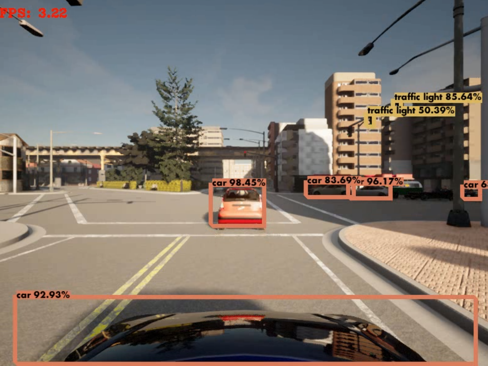

# Directory Tree:
```bash
./perception
├── assets
├── clients
│   ├── data
│   │   └── mono_camera
│   │       ├── rgb_frames
│   │       └── rgb_video
│   ├── detections
│   │   └── mono_camera
│   │       └── object_detection
│   └── __pycache__
└── detectors
    │
    │
    │
    │
    └── ObjectDetection
        └── yolov3
            ├── data
            ├── detections
            ├── venv
            ├── weights
            └── yolov3_tf2
```
<br><br><br>

<h1 align="center">2D Object Detection in CARLA</h1>


<table>
    <tr>
        <td></td>
        <td></td>
    </tr>
</table>
<br><br><br>

## Usage
--------
<br>

1. ### Create isolated virtualenv & install dependencies
```bash
$ virtualenv -p python3.7 venv
$ source ./venv/bin/activate
$ pip install -r requirements.txt
```
<br>

2. ### YOLO-v3 TensorFlow-2
follow the guide in the repo below and clone it in the detectors folder ```perception/detectors/yolov3```
then test it using the ```detect.py``` script.

```bash
$ cd ASU_AGENT/perception/detectors/ObjectDetection/
$ git clone https://github.com/theAIGuysCode/Object-Detection-API
```
<br>

3. ### RGB mono-camera Data Collection
    - offline video stream
    ```bash
    cd ASU_AGENT/perception/clients
    ```
    ```python
    $ python ./offline_mono_camera.py
    ```
    this will save offline video of the captured frame in the path: 
    ```ASU_AGENT/perception/clients/data/mono_camera/rgb_video```
    <br>

    then using yolov3 ```detect.py```
    ```bash
    python ASU_AGENT/perception/detectors/ObjectDetection/yolov3/detect.py \
    --video ASU_AGENT/perception/clients/data/mono_camera/rgb_video/output.mp4 \
    --output ASU_AGENT/perception/clients/detections/mono_camera/object_detection/doutput1.mp4
    ```
    

