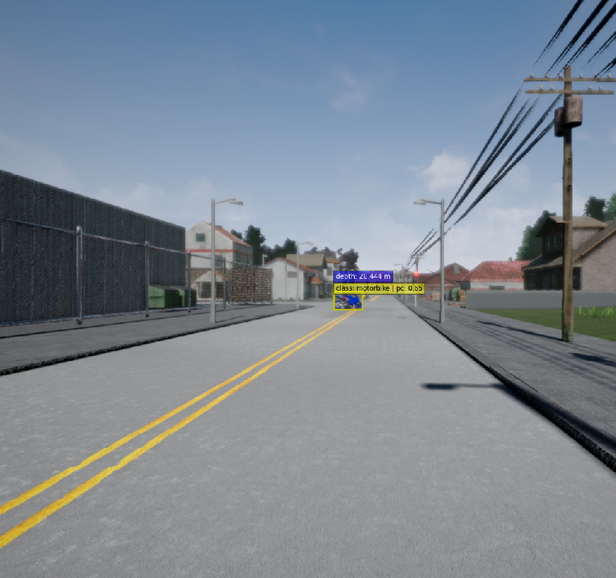
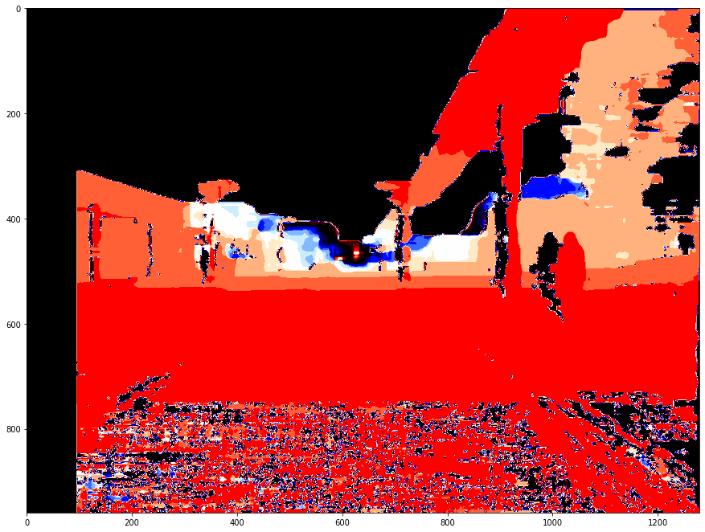
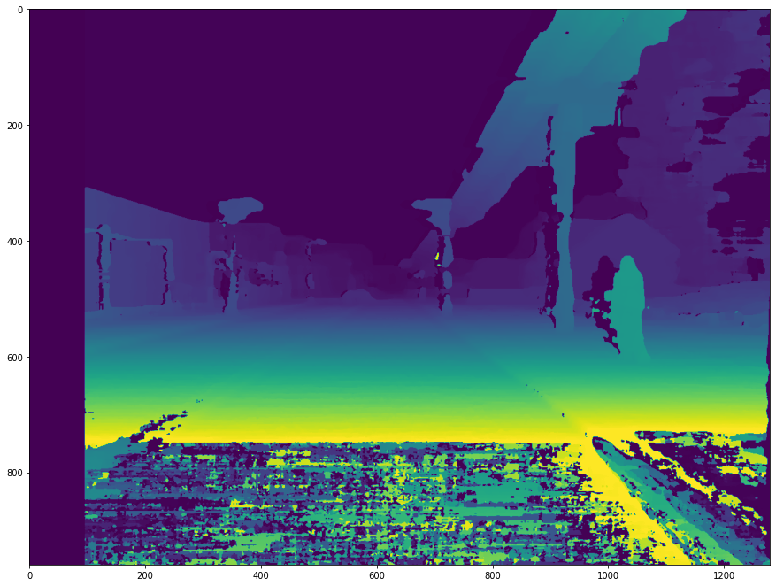
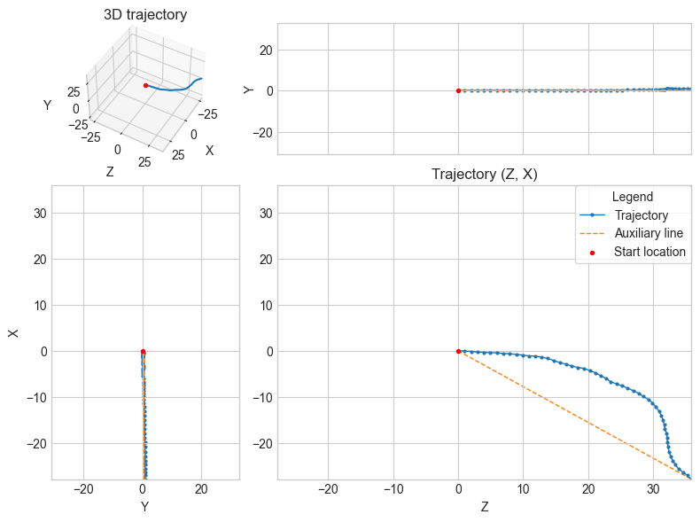
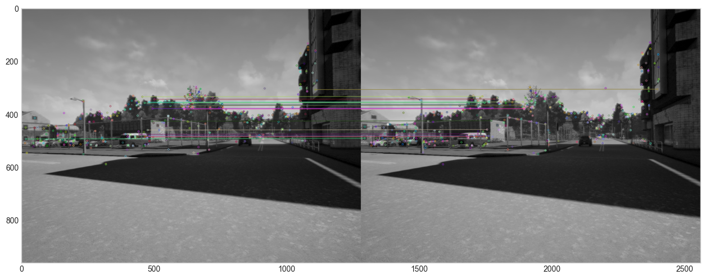
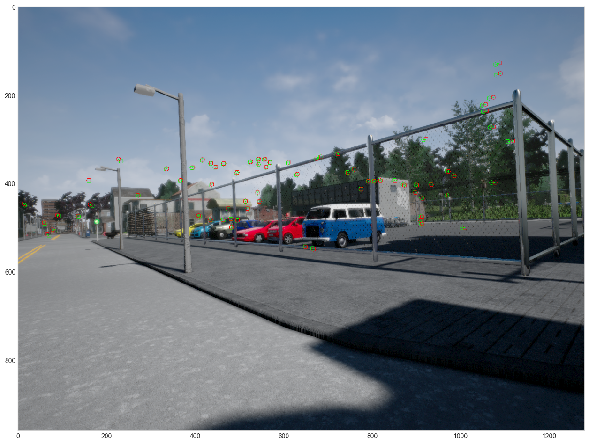
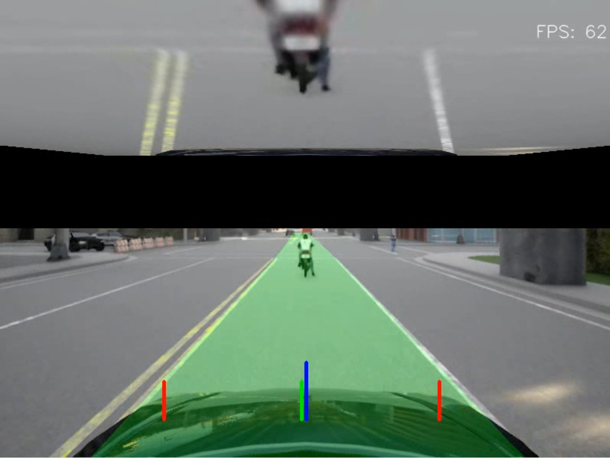

# Directory Tree:
```bash
.
├── assets
└── clients
    ├── data
    │   ├── mono_camera
    │   │   ├── rgb_frames
    │   │   └── rgb_video
    │   ├── stereo_camera
    │   │   ├── left
    │   │   └── right
    │   └── tmp
    ├── output
    │   └── mono_camera
    │       └── object_detection
    ├── scripts
    │   └── __pycache__
    └── services
        ├── depth
        ├── detection
        └── odometry
```
<br><br><br>

<h1 align="center">2D Object Detection in CARLA</h1>

<p align="center">
    
</p>
<table>
    <tr>
        <td></td>
        <td></td>
    </tr>
</table>
<br><br>


<h1 align="center">Depth Estimation [in-progress]</h1>

<p align="center">
    
</p>
<table>
    <tr>
        <td></td>
        <td></td>
    </tr>
</table>
<br><br>

<h1 align="center">Visual Odometry [in-progress]</h1>

<p align="center">
    
</p>



<br><br>

<h1 align="center">Lane Tracking [in-progress]</h1>

<p align="center">
    
</p>

<br><br><br>


## Usages
--------
<br>

1. ### Create isolated virtualenv & install dependencies
    make sure that your current dir in ```CARLA_Clients/```

    ```bash
    $ virtualenv -p python3.7 venv
    $ source ./venv/bin/activate
    $ pip install -r requirements.txt
    ```
<br>

2. ### YOLO-v3 TensorFlow-2
    follow the guide in the repo below and clone it in the detectors folder <br> ```perception/detectors/yolov3/```,  then test it using the ```detect.py``` script.

    ```bash
    $ cd ASU_AGENT/perception/detectors/ObjectDetection/
    $ git clone https://github.com/theAIGuysCode/Object-Detection-API
    ```
<br>

1. ### RGB mono-camera Data Collection
    - offline video stream
        ```bash
        cd ASU_AGENT/perception/clients
        ```
        ```python
        $ python ./offline_mono_camera.py
        ```
        this will save offline video of the captured frame in the path: 
        ```ASU_AGENT/perception/clients/data/mono_camera/rgb_video```
        <br>

        then using yolov3 ```detect.py```
        ```bash
        python ASU_AGENT/perception/detectors/ObjectDetection/yolov3/detect.py \
        --video ASU_AGENT/perception/clients/data/mono_camera/rgb_video/output.mp4 \
        --output ASU_AGENT/perception/clients/detections/mono_camera/object_detection/doutput1.mp4
        ```
    

