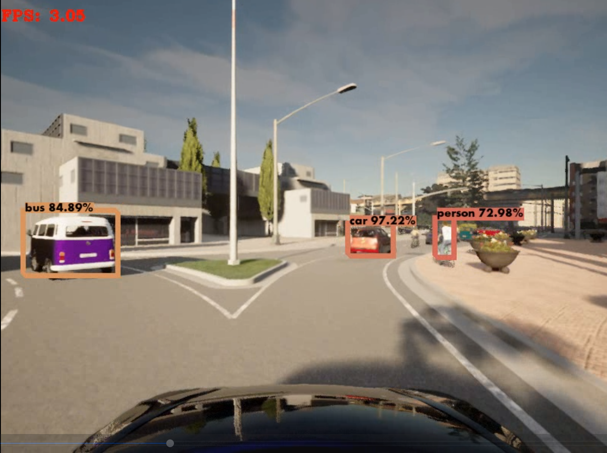

directory tree:
---------------
```bash
./perception
├── assets
├── clients
│   ├── data
│   │   └── mono_camera
│   │       ├── rgb_frames
│   │       └── rgb_video
│   ├── detections
│   │   └── mono_camera
│   │       └── object_detection
│   └── __pycache__
└── detectors
    │
    │
    │
    │
    └── ObjectDetection
        └── yolov3
            ├── data
            ├── detections
            ├── venv
            ├── weights
            └── yolov3_tf2
```

## 2D Object Detection in CARLA

<table>
    <tr>
        <td></td>
        <td></td>
    </tr>
</table>

